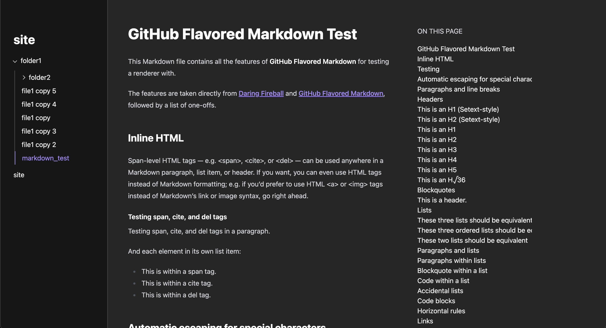
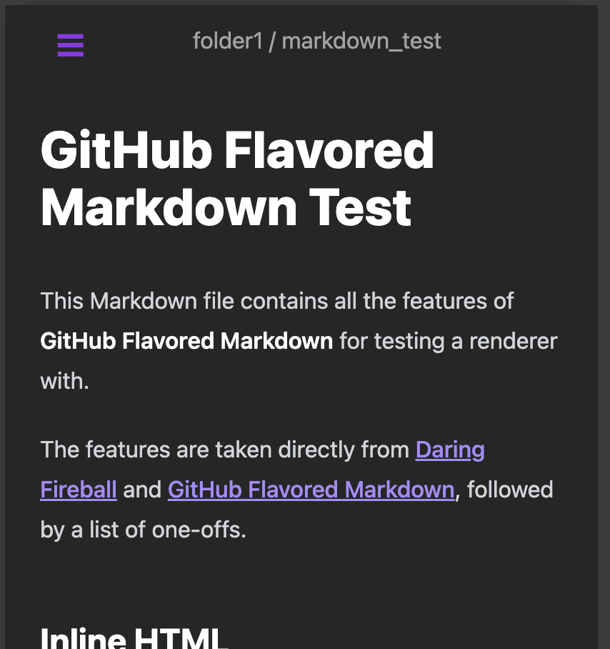
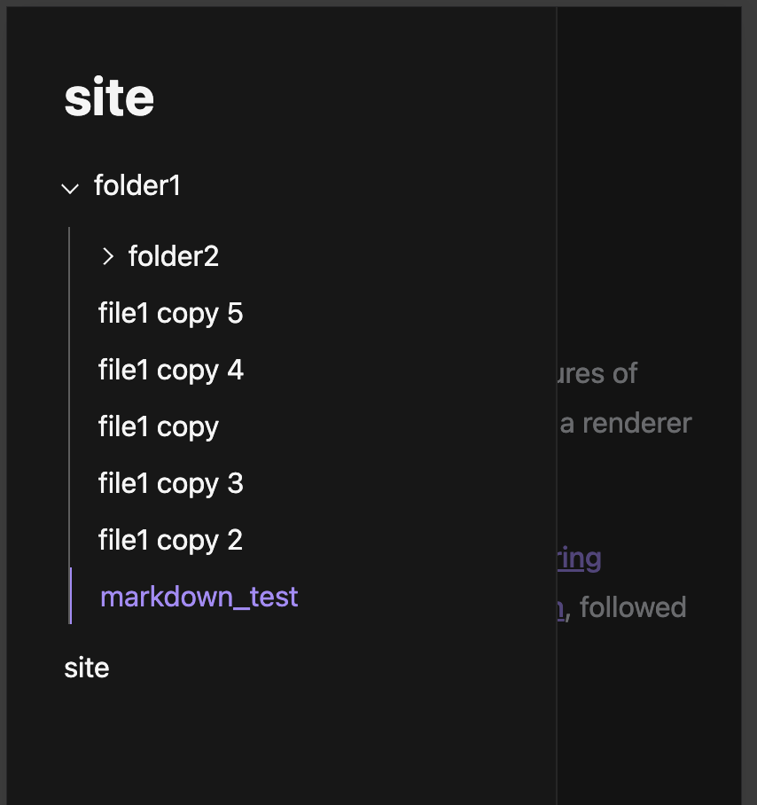

# tachylite

static site generator for markdown vaults

## features

- converts markdown files to html using [comrak](https://github.com/kivikakk/comrak)
- navbar with folders and files: collapsible and nestable.
- table of contents with headers

and obviously it must be written in rust lol

## screenshots



| mobile | support |
| -------- | ------- |
|   |     |


## usage

```bash
# build and install binary
cargo build
ln -s $PWD/target/debug/tachylite ~/bin/

# build site and spin up an HTTP server
tachylite site -o output
python3 -m http.server -d output
```

## development

the DX sucks lol

```bash
cargo run -- site && npm run build && python3 -m http.server -d output
```