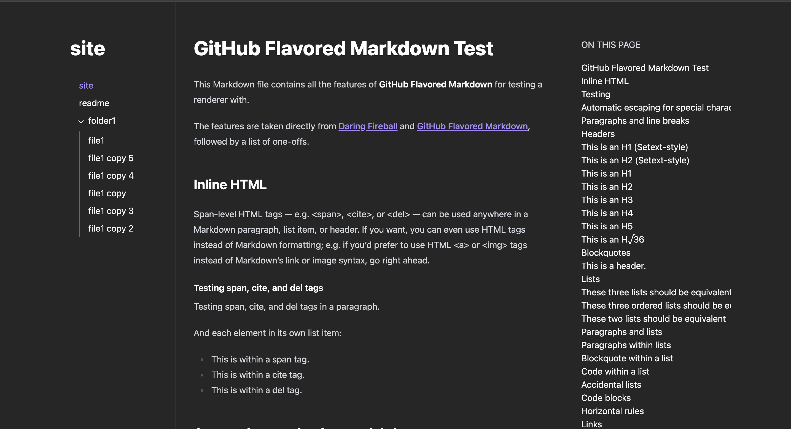

# obsidian publish

this is a static site generator that attempts to feel like obsidian publish

## features

- some way of converting markdown to html: comrak
- generate the sidebar: folders are collapsible, files are links, nestable
- generate the "on this page" sidebar for the headers, nestable

use rust for this? lol

## how it looks

